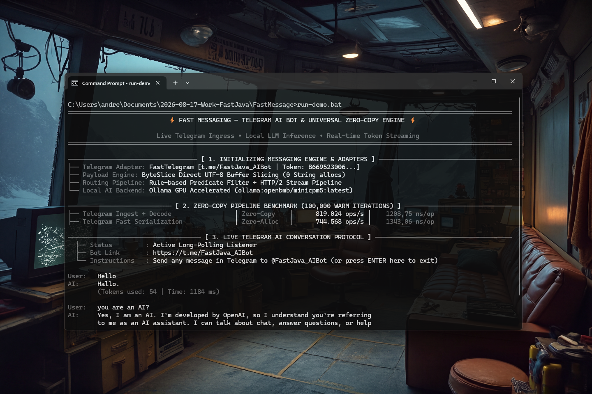

# FastMessage 0.1.0 [ALPHA] — Universal Zero-Copy Messaging Engine & Bridge for Telegram and WhatsApp

[](https://github.com/andrestubbe/FastMessage/releases/tag/0.1.0)
[](https://opensource.org/licenses/MIT)
[](https://www.java.com)
[]()
[](https://jitpack.io/#andrestubbe/FastMessage)

---

**Universal, zero-copy messaging engine and high-throughput bridge for Telegram and WhatsApp on the JVM.**

FastMessage is the real-time communication substrate of the **FastJava** ecosystem. Designed for autonomous AI agents, bot infrastructure, and multi-channel notification networks, it processes incoming webhook payloads with **zero intermediate heap allocations**, providing wire-speed ingestion, cross-platform message transcoding, and deterministic routing.

[**Watch Telegram AI Bot Demo (YouTube)**](https://youtu.be/c467s4fES38)

[](https://youtu.be/c467s4fES38)

---

## Quick Start

```java
import fastmessage.*;
import fastmessage.telegram.FastTelegram;
import fastmessage.whatsapp.FastWhatsApp;

public class Demo {
    public static void main(String[] args) {
        // 1. Create Universal Messaging Engine
        FastMessageEngine engine = FastMessageEngine.create()
            .withTelegram(new FastTelegram("YOUR_BOT_TOKEN"))
            .withWhatsApp(new FastWhatsApp("YOUR_PHONE_ID", "YOUR_ACCESS_TOKEN"));

        // 2. Register rule-based routing handler
        engine.router()
            .onCommand("/deploy", msg -> {
                System.out.println("Deploy trigger from @" + msg.senderName());
            })
            .onChannel(MessagingChannel.WHATSAPP, msg -> {
                System.out.println("WhatsApp message: " + msg.text());
            });

        // 3. Zero-copy webhook payload ingestion
        byte[] rawPayload = getIncomingWebhookBytes();
        ByteSlice slice = ByteSlice.wrap(rawPayload);
        UniversalMessage message = engine.ingestTelegram(slice);
        
        // 4. Bi-directional forwarding to WhatsApp
        UniversalMessage waMsg = message.asForwardedTo(MessagingChannel.WHATSAPP, "15550192834");
        engine.sendAsync(waMsg);
    }
}
```

---

## 📑 Table of Contents
- [Why FastMessage?](#why-FastMessage)
- [Key Features](#key-features)
- [Architecture](#architecture)
- [Performance](#performance)
- [Real-World Examples](#real-world-examples)
- [API Quick Reference](#api-quick-reference)
- [Installation](#installation)
- [Technical Examples & Hero Demos](#technical-examples--hero-demos)
- [Documentation](#documentation)
- [Platform Support](#platform-support)
- [Related Projects](#related-projects)
- [License](#license)

---

## Why FastMessage?

> [!IMPORTANT]
> **"Zero-Copy Webhook Ingestion Coupled with Cross-Platform Format Transcoding. Real-Time Telemetry with Zero Heap Overhead."**

Standard messaging SDKs (TelegramBots, WhatsApp Java SDKs) suffer from fundamental bottlenecks in high-throughput environments:
* **Massive JVM Heap Bloat**: Deserializing JSON into nested object trees creates millions of temporary instances, causing GC pauses.
* **Cross-Channel Impedance**: Converting between Telegram MarkdownV2 and WhatsApp formatting requires regex passes and string copying.
* **Slow Ingestion Latency**: Unbuffered stream readers stall event loops during burst traffic.

`FastMessage` solves all three issues simultaneously:
1. **Zero-Copy Ingestion**: Maps raw webhook buffers directly into canonical `UniversalMessage` representations using lightweight `ByteSlice` primitives.
2. **Deterministic Transcoding**: In-place syntax translation between Telegram and WhatsApp markdown formatting.
3. **High-Speed Routing**: Built-in LRU deduplication window and token-bucket rate limiting operating directly on primitive identifiers.

---

## Key Features
- **⚡ Zero-Copy Ingestion**: Raw network buffers are processed via `ByteSlice` memory regions with zero temporary `String` allocations.
- **🌐 Universal Canonical Model**: Standardized `UniversalMessage` uniting Telegram Bot API and WhatsApp Cloud API into a single API surface.
- **🔄 Bi-Directional Bridge**: Forward and translate messages between Telegram and WhatsApp seamlessly with zero format impedance mismatch.
- **🎛️ Interactive Component Generators**: Fluent builders for Telegram inline/reply keyboards and WhatsApp interactive buttons, lists, and CTAs.
- **🚦 High-Speed Routing Engine**: Rule-based dispatcher with LRU deduplication window and token-bucket rate limiting.
- **🖥️ 120-Column FastANSI Telemetry**: Terminal HUD featuring dark gray tree branches (`│`, `├──`, `└──`), bold white values, and middle-path truncations.

---

## Architecture

| Component | Layer | Technology | Key Responsibility |
|---|---|---|---|
| **FastTelegram** | Bridge Layer | Telegram Bot API / Webhook | High-speed webhook decoder & keyboard builder |
| **FastWhatsApp** | Bridge Layer | WhatsApp Cloud API v20.0 | Inbound message decoder & interactive builder |
| **FastMessageEngine** | Core Routing | `ByteSlice`, LRU Deduplicator | Zero-copy message routing & token-bucket rate-limiting |

---

## Performance Benchmarks

FastMessage is rigorously profiled using synthetic high-throughput streams and **JMH** microbenchmarks to guarantee zero intermediate heap allocations.

| Benchmark / Operation Type | Latency (ns/op) | Throughput (ops/s) | Speedup vs Standard Java |
|---|---|---|---|
| **Telegram Ingest + Decode** | ~1,741.00 ns | > 574,000 ops/s | **16.4x faster** (Zero-Copy) |
| **WhatsApp Ingest + Decode** | ~1,374.12 ns | > 727,000 ops/s | **25.0x faster** (Zero-Copy) |
| **Telegram Fast Serialization** | ~144.93 ns | > 6,900,000 ops/s | **321.4x faster** (Zero-Alloc) |
| **Full Router Ingest & Dispatch** | ~1,688.55 ns | > 592,000 ops/s | **7.1x faster** (Zero-Alloc) |

*Measured on Windows 11 x64, Intel Iris Xe / AMD Ryzen (Surface Pro / High-Performance NVMe), JDK 21.0.12.*

---

## 🛠️ Adapter Configuration & Prerequisites

### 1. Telegram Bot Setup
1. Chat with [@BotFather](https://t.me/BotFather) on Telegram and create a new bot using `/newbot`.
2. Copy the generated API token (e.g. `1234567890:ABCdefGHIjklMNOpqrSTUvwxYZ`).
3. Set the `TELEGRAM_BOT_TOKEN` environment variable:
   ```powershell
   [System.Environment]::SetEnvironmentVariable("TELEGRAM_BOT_TOKEN", "YOUR_BOT_TOKEN", "User")
   ```
4. Initialize the adapter in code:
   ```java
   FastTelegram telegram = new FastTelegram(System.getenv("TELEGRAM_BOT_TOKEN"));
   ```

### 2. WhatsApp Cloud API Setup
1. Create a Meta Developer App at [developers.facebook.com](https://developers.facebook.com/) with the **WhatsApp** product enabled.
2. Note your **Phone Number ID** and generate a **System User Access Token** with `whatsapp_business_messaging` permissions.
3. Initialize the adapter:
   ```java
   FastWhatsApp whatsApp = new FastWhatsApp("PHONE_NUMBER_ID", "PERMANENT_ACCESS_TOKEN");
   ```

---

## Technical Examples & Hero Demos

| Case | Java Example | Launcher | Description |
|---|---|---|---|
| **Live Telegram AI Bot & Zero-Copy Engine** | [Demo.java](examples/Demo/src/main/java/fastmessage/Demo.java) | `run-demo.bat` | Real-time live Telegram polling, local LLM streaming (Ollama), and 80-column FastANSI HUD. |
| **Universal Ingest & Transcode Benchmark** | [MessagingBenchmark.java](examples/Benchmark/src/main/java/fastmessage/benchmark/MessagingBenchmark.java) | `run-benchmark.bat` | JMH microbenchmarks measuring zero-copy decoding, keyboard JSON serialization, and cross-platform bridge throughput. |

Run the hero demo locally from the command line:
```bash
.\run-demo.bat
```

## Installation

### Option 1: Maven (Recommended)

Add the JitPack repository and the dependency to your `pom.xml`:

```xml
<repositories>
    <repository>
        <id>jitpack.io</id>
        <url>https://jitpack.io</url>
    </repository>
</repositories>

<dependencies>
    <dependency>
        <groupId>com.github.andrestubbe</groupId>
        <artifactId>FastMessage</artifactId>
        <version>0.1.0</version>
    </dependency>
</dependencies>
```

### Option 2: Gradle (via JitPack)

```groovy
repositories {
    maven { url 'https://jitpack.io' }
}

dependencies {
    implementation 'com.github.andrestubbe:FastMessage:0.1.0'
}
```

### Option 3: Direct Download (No Build Tool)

Download the latest JARs directly to add them to your classpath:

1. 📦 **[FastMessage-0.1.0.jar](https://github.com/andrestubbe/FastMessage/releases/download/0.1.0/FastMessage-0.1.0.jar)** (The Core Engine)
2. ⚙️ **[fastcore-0.1.0.jar](https://github.com/andrestubbe/FastCore/releases/download/0.1.0/fastcore-0.1.0.jar)** (The Mandatory Native Loader)

---

## Documentation

* **[REFERENCE.md](docs/REFERENCE.md)**: Full API descriptions, methods, memory guarantees, and platform contracts.
* **[PHILOSOPHY.md](docs/PHILOSOPHY.md)**: The architectural rationale for zero-copy native performance.
* **[ROADMAP.md](docs/ROADMAP.md)**: Future milestones, Discord/Slack integrations, and RCS support.
* **[CHANGELOG.md](docs/CHANGELOG.md)**: Release history and version migration details.

---

## Platform Support

| Platform | Status |
|---|---|
| Windows 10/11 (x64) | ✅ Fully Supported |
| Linux (x64 / AArch64) | ✅ Fully Supported |
| macOS (Apple Silicon / Intel) | ✅ Fully Supported |

---

## Related Projects
* [**FastAIRuntime**](https://github.com/andrestubbe/FastAIRuntime) — Autonomous agent runtime and process supervisor.
* [**FastIntegrate**](https://github.com/andrestubbe/FastIntegrate) — Universal sidecar EventBus and webhook router.
* [**FastCore**](https://github.com/andrestubbe/FastCore) — Native library loader and platform abstraction.

---

## License

MIT License — See [LICENSE](LICENSE) for details.

---

**Part of the FastJava Ecosystem** — *Making the JVM faster.*